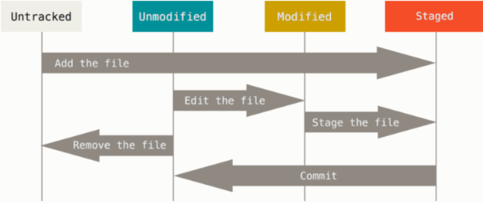
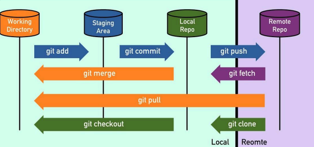

# 1주차

## Git을 사용하는 이유
> **버전 관리** 및 **협업**을 위해 사용하는 오픈소스 소프트웨어
#### 버전 관리 
새로운 기능을 추가했을 때 이전 버전으로 되돌리고 싶거나 치명적인 버그가 발생하였을 때 용이

#### 다른 개발자와의 협업
실시간으로 작업 내역을 공유할 수 있는 원격저장소 역할

## 파일의 생명주기
### 1. Untracked
파일이 추적되고 있지 않음. `git add`를 통해 추적 가능

### 2. Tracked 영역

- Unmodifed : 파일이 추적되고 있고, 마지막 커밋 이후로 수정되지 않음
- Modified : 파일이 추적되고 있고, 마지막 커밋 이후에 수정됨
- Staged : Modified상태의 파일이 `git add`를 통해 Staging Area에 올라간 상태. 커밋 준비 완료

## Git 영역

- Working Directory : 사용자가 실제로 작업하는 공간
     ex. VScode
- Staging Area : 커밋 준비가 완료된 파일들이 존재하는 공간.  `git add`로 해당 영역에 추가
- Repository : Local과 Remote로 나뉨. 실제 Git이 관리하는 데이터 저장소
 `git commit` 시 이 영역에 저장됨
    - Local : 사용자의 로컬 환경에 존재
    - Remote : GitHub와 같은 VCS에 존재

## GitHub에서 제공하는 일부 기능
1. 이슈 트래킹
2. 코드 리뷰
3. GitHub Action으로 CI/CD
4. GitHub Projects로 프로젝트 업무 관리

## Commit Convention
|타입|설명|
|----|----|
|feat|새로운 기능 추가|
|refactor|코드 리팩토링|
|fix|버그 수정|
|chore|코드 외 설정 변경|
|docs|문서화|
|test|테스트 코드|
|style|코드 스타일 수정|
|revert|이전 커밋 되돌림|

## 주요 명령어
- `git status` : 현재 작업 디렉토리의 파일 상태
- `git add .` : 현재 디렉토리 내 변경된 모든 파일 스테이징
- `git commit -m "<message>"` : 커밋과 메시지 동시 작성
