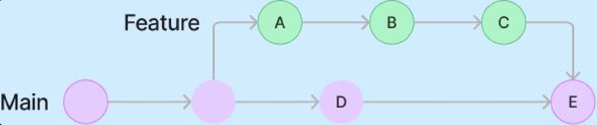
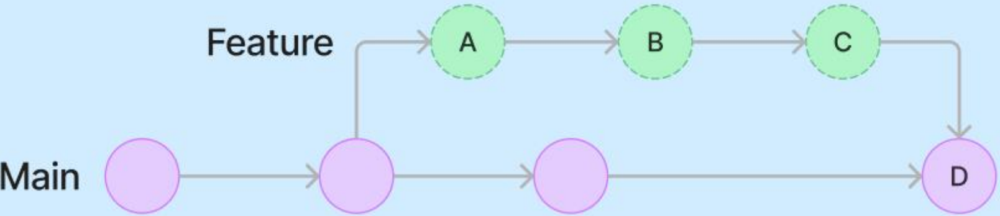
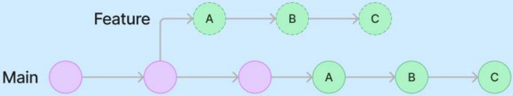

# 2주차

## Fork
다른 사용자의 Repository를 내 계정으로 복사해서 독립적으로 수정하고 관리 가능

## Star
관심 있는 Repository나 프로젝트를 북마크처럼 저장 가능

## Issue
Repository에서 작업 계획, 토론 및 추적을 위해 활용. 프로젝트에 대한 버그 제보, 기능 요청, 질문 등을 등록하는 공간으로, 개발자와 사용자 간의 소통 창구 역할을 한다.

## Branch
기존 브랜치에서 분기되어 생성되는 별도의 작업 공간으로, **fork와 달리 같은 Repository에 생성된다.**

- ### Branch naming convention
    > type/\<issue number\>-\<short-description\>

    | Branch type | Description      |
    |-------------|------------------|
    | feature/    | 새로운 기능 개발  |
    | fix/        | 버그 수정         |
    | hotfix/     | 긴급 패치        |
    | release/    | 배포용 브랜치    |
    | docs/       | 문서 작업        |
    | test/       | 테스트 코드      |
    | chore/      | 기타 작업        |

-   ### Pull Request
    분기된 Branch를 원본 저장소에 병합해 달라고 요청하는 절차. 주로 협업 시 코드 리뷰와 병합 과정을 거치기 위해 사용

- ### Merge
    ### 1. Create a merge commit

    두 브랜치를 공통 부모로 하는 새로운 commit을 생성. history를 보존하며 브랜치 간 관계가 명확하다.
    

    ### 2. Squash and merge
    여러 커밋을 하나의 커밋으로 병합
    

    ### 3. Rebase and Merge
    > Rebase 방식은 commit hash가 변경되어 무수한 충돌이 발생할 수 있으니 협업 시 사용 주의

    history를 직선으로 정리. 커밋들의 base를 바꿔 다른 브랜치 위에 쌓아올린다.
    
    ```mathematica
    Before:
    A---B---C (main)
        \
        D---E (feature)

    After rebase:
    A---B---C---D'---E' (feature rebased)
    ```

https://github.com/jaychung0101/2025-1-Beginner-Study/pull/2