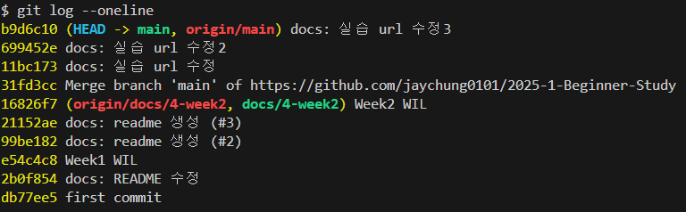

# 3주차

## 브랜치 명령어
```bash
# 현재 브랜치 확인 / 모든 브랜치 확인
$ git branch 
$ git branch -a

# 브랜치 생성, 이동
$ git branch <branchName>
$ git checkout <branchName>
$ git checkout -b <branchName>

# 브랜치 삭제
$ git branch -D <branchName>
```

## Pull
```bash
# A브랜치의 변경사항을 현재 브랜치로 가져오기
$ git pull origin A

$ git checkout main
$ git pull origin main
```

## Git Log
#### Git Log
- commit 기록을 최신 순으로 확인
- `--oneline`옵션을 사용하면 한 줄에 각 커밋 요약
