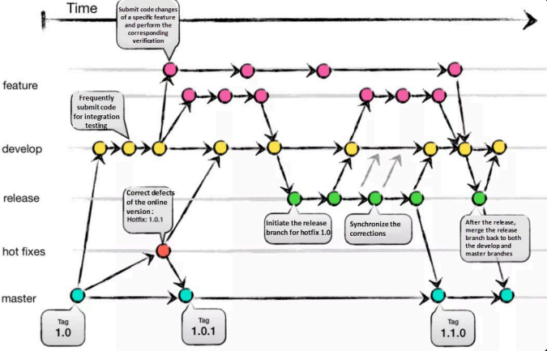
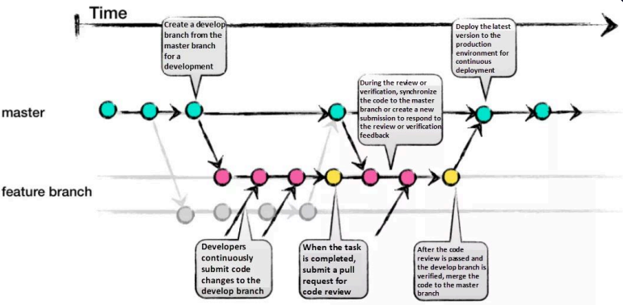

# 4주차

## 브랜치 전략
### 브랜치 관리의 필요성
- 브랜치 분리: 브랜치 간 영향을 미치지 않음
- 브랜치 구분: 각 브랜치가 어떤 용도로 사용되는지
- main 브랜치의 안전한 관리

### 브랜치 보호 규칙
- Pull Request를 병합하려면 승인 필요
- 특정 브랜치 push 가능 권한 제한

## Git Flow

### 브랜치의 종류
#### Main Branches
- main(master): 
    - 프로젝트 생성 시 기본으로 생성되는 브랜치로 master를 사용하기도 한다.
    - 영원히 존재하는 첫 번째 브랜치이며 병합될 때마다 제품의 새로운 버전이 탄생한다.

- develop:
    - 영원히 존재하는 두 번째 브랜치로 **feature 브랜치의 기반**이 된다.

#### Supporting Branches
- feature: 
    - delvelop 브랜치에서 분기하여 작업한다
    - 기능 개발 완료 후 develop 브랜치로 병합한다.
- release:
    - 배포 준비를 위한 브랜치
    - 자잘한 버그 수정 및 QA 작업을 한다.
    - develop 브랜치에서 분기하여 main 브랜치로 병합한다.
- hotfix:
    - **배포 환경에서 즉각적인 수정이 필요할 경우** 사용한다.
    - main 브랜치에서 분기하며 main, develop 브랜치 모두에 병합해야한다.

## GitHub Flow
기존의 Git Flow는 배포가 수시로 이루어지는 현 시대의 웹앱과는 부적합

### 브랜치의 종류
> Git Flow와 달리 **main**과 **feature** 브랜치만 존재
#### Main
- 항상 배포 가능 상태로 유지
- main으로 병합 전 충분한 테스트가 필요하다

#### feature
- 브랜치의 목적을 이름에 잘 담아야 한다.
- 바로 main 브랜치에 병합되기 때문에 Git Flow에 비해 코드 리뷰가 훨씬 중요하다.

## 개발자로서의 Attitude
### 1. Convention을 만들어 사용하자.
| 목적 | 설명 |
|-----|-------|
| 📖 이해하기 쉬운 히스토리 | 커밋 메시지만 보고도 변경 내용을 쉽게 파악할 수 있음                         |
| 🤝 협업 시 명확한 소통     | 팀원 간 커밋 의미를 빠르게 공유하고 리뷰 효율 향상                           |
| 🧪 자동화 도구와 연동      | 커밋 메시지를 기반으로 자동 릴리즈, 버전 태깅, 테스트 트리거 가능              |
| 🧾 CHANGELOG 자동 생성   | `feat`, `fix` 등 유형별로 변경 이력을 자동으로 문서화 가능                    |
| 🧼 일관된 코드 관리       | 규칙적인 메시지 스타일로 코드베이스가 깔끔하게 유지됨                         |

### 2. 구글링을 꼼꼼히 하자

### 3. 코드에 대한 주인 의식을 가지자
public repository에 있는 코드는 자신의 얼굴이므로, 돌아가기만 하는 코드보다는 잘 설계된 코드를 짜도록 노력하자.

### 4. 질문을 잘 하자